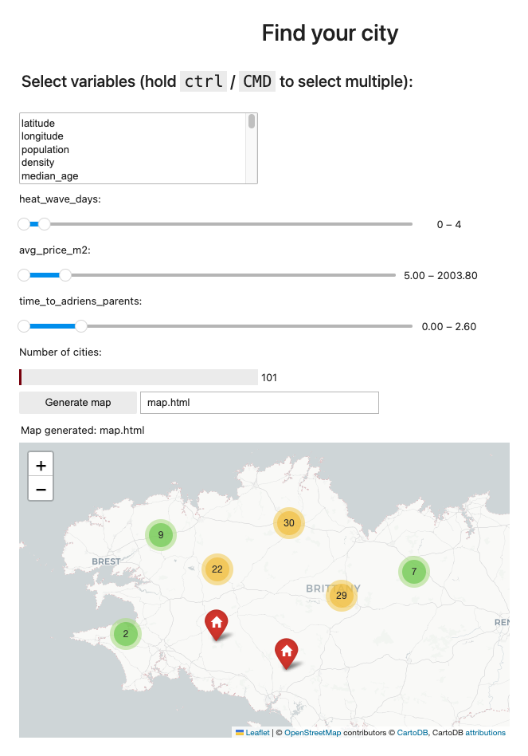

# City Search

This is a small project designed to help you find the ideal city in France. It consists of two main components:

- A web scraper that collects a set of variables for most French cities and villages.
- A filtering app that displays only the cities that meet the criteria you specify for the collected variables.


## Installation

The project uses Poetry to manage its dependencies, making the installation process easy:

```bash
cd <PROJECT_PATH>
poetry install
```

## Database
The database is stored in `commune.db` and can be updated by running the web scraper again. Please note that this process can be time-consuming(~2h) as it is not optimized or parallelized.

```bash
poetry run python get_data.py --config config.yaml
```

## Filtering the Cities
The project includes a Jupyter notebook that allows you to set constraints on city variables and visualize the cities that meet those constraints.

```bash
voila city_select_app.ipynb
```

